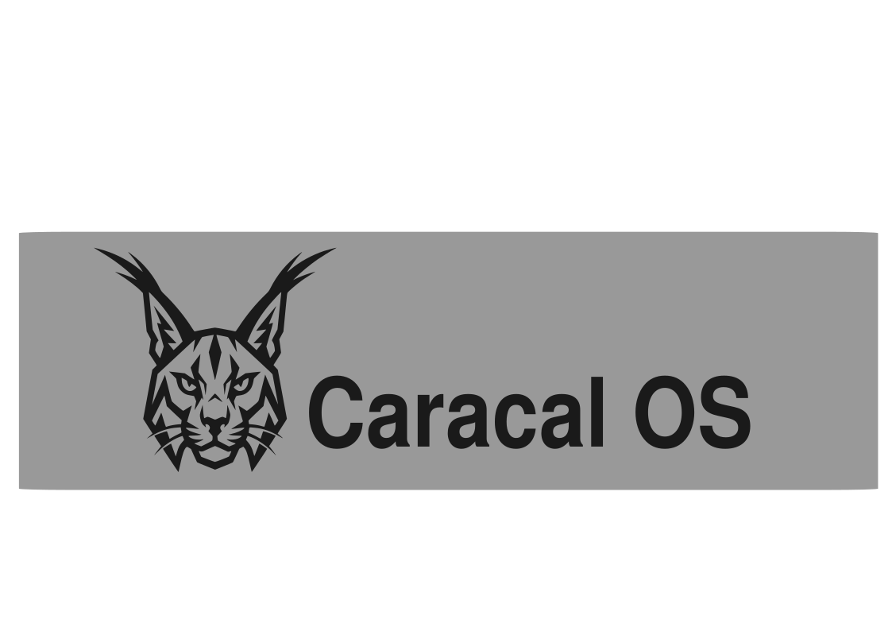

[](https://github.com/caracal-dev/caracal/actions/workflows/build.yml) 
[](https://github.com/caracal-dev/caracal/actions/workflows/build-disk.yml)

<picture>
  <source media="(prefers-color-scheme: dark)" srcset="assets/images/caracal-banner-dark.png">
  <source media="(prefers-color-scheme: light)" srcset="assets/images/caracal-banner-light.png">
  
</picture>

A custom [bootc](https://github.com/bootc-dev/bootc) image built on Fedora Kinoite (KDE Plasma), tuned from the ground up for audio production. Caracal-OS delivers a fast, immutable Linux desktop with the core production stack ready on first boot, while heavier optional software ships through the bundled Caracal Software Installer.

---

## What's Inside

### Performance

- **Bazzite kernel** — replaces the stock Fedora kernel with Bazzite's pre-built OCI kernel image
- **CPU governor** — defaults to `performance` mode
- **Realtime/memlock limits** — `@audio` and `@realtime` groups preconfigured with `rtprio 95` and unlimited memlock through both PAM and `systemd`

### DAWs (included)

| DAW | Notes |
|-----|-------|
| Ardour 9 | Full-featured professional DAW |
| Qtractor | MIDI/audio sequencer |
| Carla | Plugin host / patchbay |

**Optional DAWs** (install after first boot via `ujust`):

```
ujust install-reaper
ujust install-renoise
ujust install-bitwig
ujust uninstall-reaper
ujust uninstall-renoise
ujust uninstall-bitwig
```

For the broader optional catalog, launch the bundled Caracal Software Installer from the app launcher or run:

```bash
ujust software-installer
```

### Plugins & Instruments

Plugins are installed system-wide in LV2, VST3, and CLAP formats where available.

**Included out of the box:**

- LSP Plugins, ZAM Plugins, Calf, Dragonfly Reverb, BYOD
- OB-Xf, Vaporizer2, Odin2, Dexed, AIDA-X, Neural Amp Modeler
- INTERSECT, Wavetable, jDrummer, Crypt2, LostAndFoundPiano
- Guitarix, SooperLooper, Rakarrack
- Bristol, Synthv1, Drumkv1
- Full x42 and SWH LV2 plugin sets

**Optional installs available through Caracal Software Installer:**

- REAPER, Renoise, Bitwig Studio
- Cardinal, Surge XT, Decent Sampler, Loopino
- SunVox, Virtual ANS, TAL-Noisemaker, Wavetable
- INTERSECT, Audio Assault plugins, RTCQS

**Windows VST support:**

- Wine TKG + Yabridge — run Windows VST2/VST3 plugins natively inside Linux DAWs

### Audio Stack

- JACK (`jack-audio-connection-kit`, `qjackctl`, `ffado` for FireWire interfaces)
- PipeWire + ALSA bridge (`pipewire-alsa`, `pavucontrol`)
- MIDI: QSynth, FluidSynth, General MIDI soundfont, Timidity++, VMPK, QMidiArp, HarmonySeq

### Shell & Tooling

- Zsh + Oh My Zsh (pre-configured skel in `/etc/skel`)
- `oh-my-posh` prompt, `eza`, `zoxide`, `fzf`, `ripgrep`, `fd`
- Neovim, Alacritty, 7zip, rsync

### Instructions to install Vital Synth

Caracal ships with Vitalium pre-installed. Vitalium is a ported version of Vital but may be missing some of the additional features and ecosystem of Vital.

If Vitalium does not fit your needs and you wish to install Vital, you can. To install it:

1. Create an account at [vital.audio](https://vital.audio) and download the Linux RPM installer labelled as "Linux (rpm)".
2. Change into the directory where you saved it, for example:
```bash
cd ~/Downloads
```

3. Install it on the host:
```bash
sudo rpm-ostree install VitalInstaller.rpm
```

Reboot after the `rpm-ostree` install completes.

---

## Installation

### Prerequisites

- A machine running any bootc-compatible image (Bazzite, Bluefin, Aurora, or plain Fedora Atomic)
- A GitHub account (to pull the published image from GHCR)

### Switch to Caracal-OS

```bash
sudo bootc switch ghcr.io/caracal-dev/caracal:latest
```

Reboot to apply. On first login, run the guided setup:

```bash
ujust first-run
```

That recipe adds you to the `audio` and `realtime` groups, installs the shell extras, and sets up yabridge.

Or do the group step manually:

```bash
sudo usermod -aG audio,realtime $USER
```

Then reboot, or at minimum log out and back in, so the new group membership and session limits take effect.

---

## Building Locally

Requires [just](https://just.systems/) and Podman.

```bash
# Build the container image
just build

# Build a bootable QCOW2 (for testing in a VM)
just build-qcow2

# Run in a VM
just run-vm-qcow2
```

See the [Justfile](./Justfile) for all available recipes.

---

## Image Verification

All published images are signed with [cosign](https://github.com/sigstore/cosign). Verify with:

```bash
cosign verify --key cosign.pub ghcr.io/caracal-dev/caracal:latest
```

---

## Based On

- [Fedora Kinoite](https://fedoraproject.org/kinoite/) — KDE Plasma on Fedora Atomic
- [Universal Blue image-template](https://github.com/ublue-os/image-template)
- [Bazzite kernel](https://github.com/bazzite-org/kernel-bazzite)

## Special Thanks to:
- Fedora Kinoite - The base this image is built on
- Universal Blue - for making this type of project possible
- Bazzite - for the many performance enhancements
- [Secureblue](https://github.com/secureblue/secureblue) - for some security improvement ideas
- [Zirconium](https://github.com/zirconium-dev/zirconium) - excellent learning source
- [Zena](https://github.com/zena-linux/zena) for providing an example of CachyOS kernel implementation
